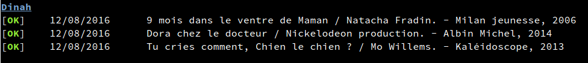
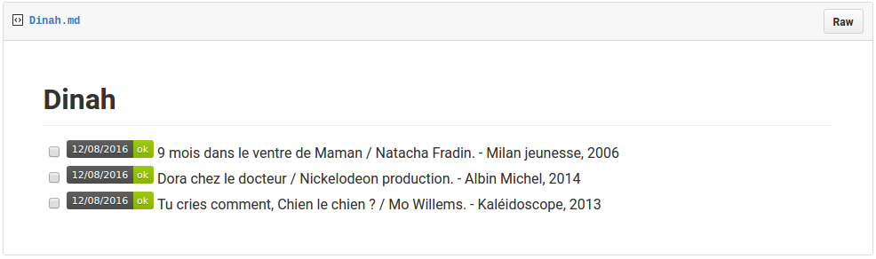

Mediago
=======

Check book status for http://www.bm-chambery.fr/

Supports checking multiple accounts.





# Installing

```shell
$ go get github.com/raphink/mediago
```


# Configuration example

```toml
# $HOME/.mediago.conf
renew_before = "24h"
alert = "smtp"
report = "gist"

[[account]]
name = "Foo"
login = "CHAM123456"
password = "SUPERPASS"

[[account]]
name = "Bar"
login = "CHAM456789"
password = "ANOTHERPASS"

[gist]
token = "dfjdsfjkls2334589"
gist_id = "1dsfdsjk32"

[smtp]
username = "smtp_user"
password = "email_pass"
hostname = "smtp.example.com"
port = 587
recipients = ["foo@example.com", "bar@example.com"]
```
